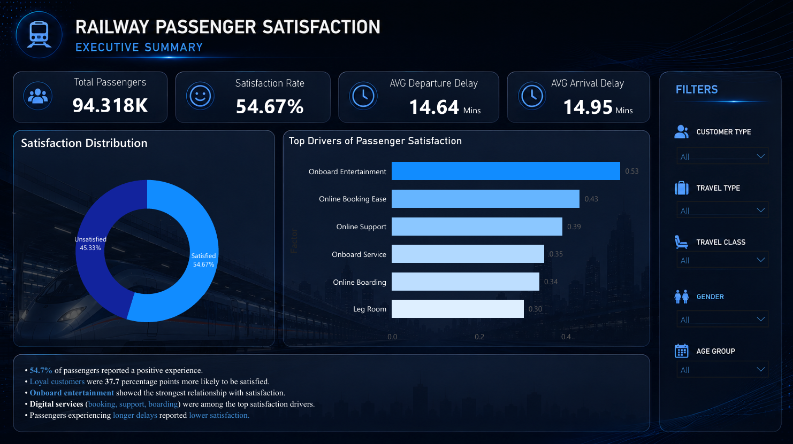
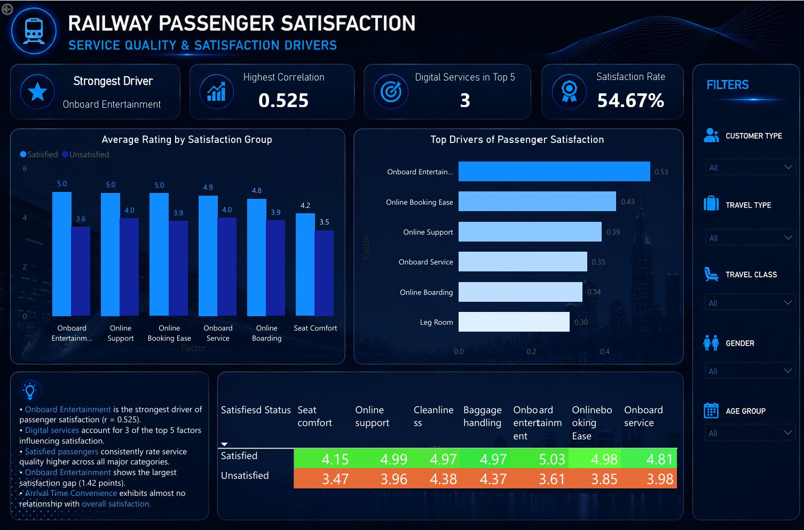
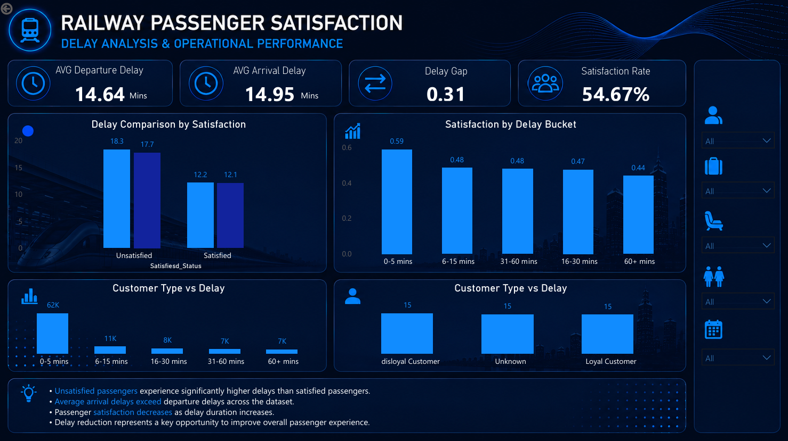
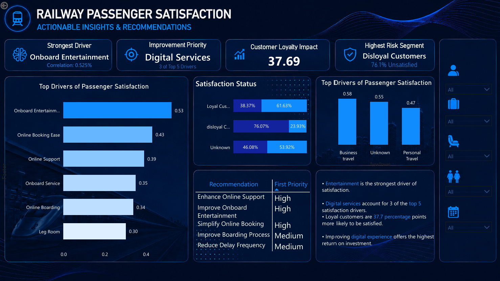

## Dashboard Preview

### Executive Summary

### Service Quality & Satisfaction Drivers

### Delay Analysis & Operational Performance

### Actionable Insights & Recommendations

Railway Passenger Satisfaction Analytics

Project Overview

This project analyzes railway passenger satisfaction using travel and survey datasets. The objective is to identify the factors that influence passenger satisfaction and provide actionable recommendations for improving passenger experience.
The project combines Python, Power Query, and Power BI to perform data cleaning, exploratory data analysis (EDA), correlation analysis, and dashboard development.
________________________________________
Objectives
The analysis seeks to answer the following questions:
1.	What factors most influence passenger satisfaction?
2.	How do departure and arrival delays affect passenger satisfaction?
3.	Are loyal customers more satisfied than disloyal customers?
4.	Do business travelers and personal travelers experience different satisfaction levels?
5.	What actions should railway operators prioritize to improve passenger satisfaction?
________________________________________
Tools Used
•	Python (Pandas)
•	Power BI
•	Power Query
•	DAX
•	Microsoft Excel
________________________________________
Dataset
The project uses two datasets:
•	Travel Data
•	Passenger Survey Data
Both datasets were merged using the common key:
ID
Final dataset:
•	94,379 passenger records
•	25 variables
________________________________________
Data Preparation
The following preprocessing steps were performed:
•	Merged travel and survey datasets
•	Removed Platform_location due to excessive missing values and lack of variation
•	Treated missing values using Power Query
•	Converted service ratings into numerical values
•	Created derived fields for dashboard analysis
•	Validated data types and dataset quality
________________________________________
Dashboard Pages
Page 1 — Executive Summary
Provides an overview of passenger satisfaction, delay performance, and key drivers.
Page 2 — Service Quality & Satisfaction Drivers
Analyzes the service attributes most strongly associated with passenger satisfaction.
Page 3 — Delay Analysis & Operational Performance
Investigates the relationship between delays and passenger satisfaction.
Page 4 — Actionable Insights & Recommendations
Summarizes the most important findings and presents improvement recommendations.
________________________________________
Key Findings
1. Service Quality Drives Satisfaction
The strongest service drivers were:
•	Onboard Entertainment
•	Online Booking Ease
•	Online Support
•	Onboard Service
•	Online Boarding
2. Delays Reduce Satisfaction
Unsatisfied passengers experienced significantly higher arrival and departure delays than satisfied passengers.
3. Customer Loyalty Matters
•	Loyal Customer Satisfaction Rate: 61.6%
•	Disloyal Customer Satisfaction Rate: 23.9%
Customer loyalty showed one of the strongest relationships with satisfaction.
4. Business Travelers Are More Satisfied
Business travelers reported higher satisfaction levels than personal travelers.
5. Digital Services Are Critical
Three of the five strongest satisfaction drivers were related to digital service quality.
________________________________________
Recommendations
Based on the analysis, the following actions are recommended:
1.	Improve onboard entertainment services.
2.	Enhance online booking experience.
3.	Strengthen digital customer support.
4.	Reduce operational delays.
5.	Develop retention strategies for disloyal customers.
________________________________________
Repository Structure
Railway-Passenger-Satisfaction-Analytics/

├── Dashboard/
│   └── Dashboard.pbix
│
├── Dataset/
│   ├── raw_data.csv
│   └── cleaned_data.csv
│
├── Documentation/
│   ├── Finding.md
│   ├── Data Cleaning and Preprocessing.md
│   ├── project_plan.md
│   └── data_dictionary.xlsx
│
├── Screenshots/
│   ├── page1.png
│   ├── page2.png
│   ├── page3.png
│   └── page4.png
│
└── README.md
________________________________________
Author
Santhosh S
B.Sc. Artificial Intelligence & Data Science
KPR College of Arts, Science and Research
India

